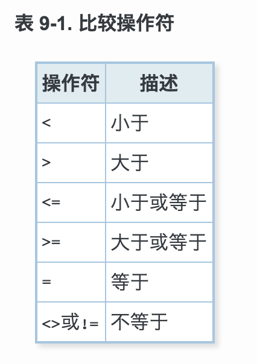
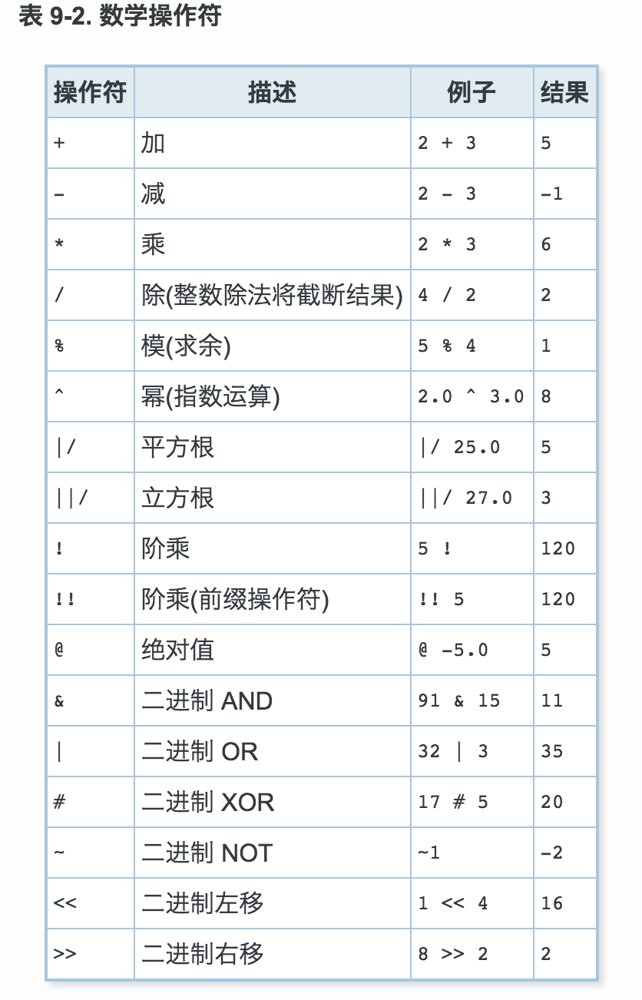
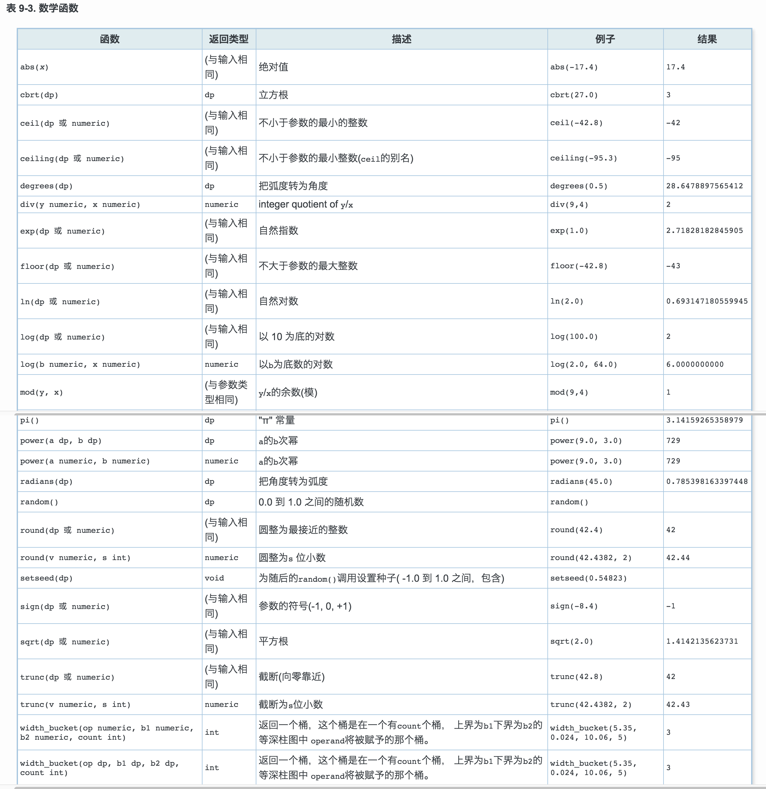
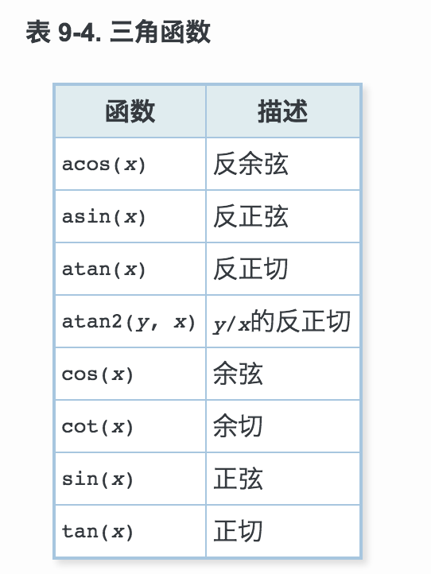
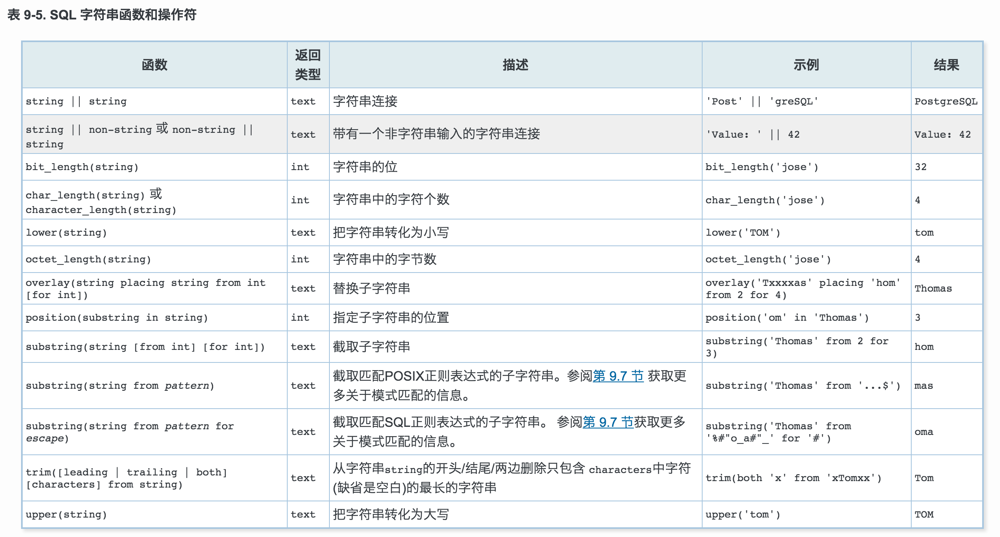
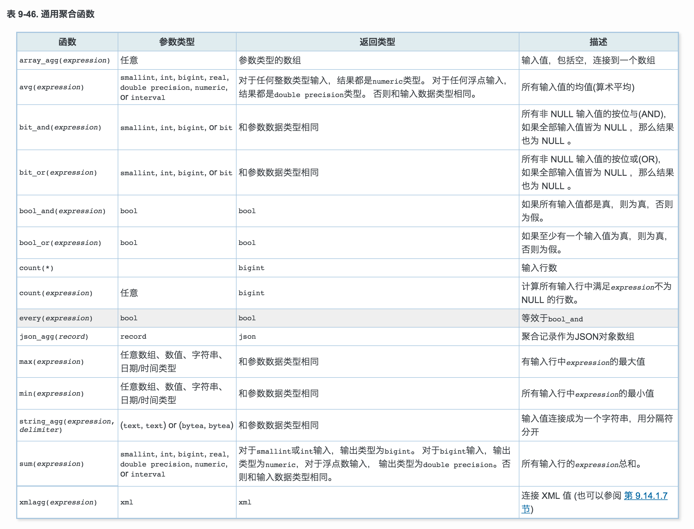
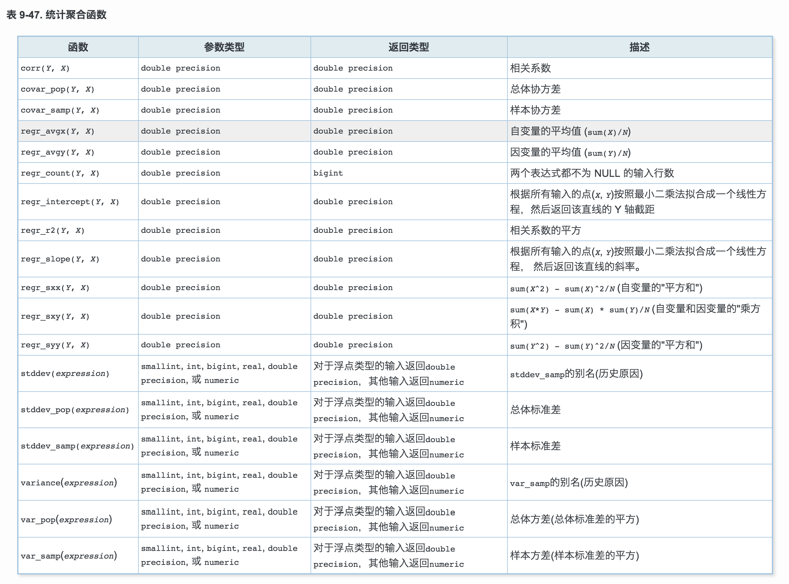
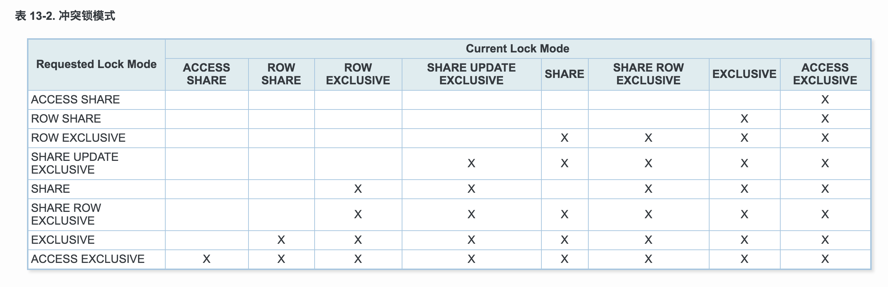

# PostgreSQL

## 主键

UNIQUE NOT NULL 等价于 PRIMARY KEY

FOREIGN KEY 外键

REFERENCES 约束外键

ON DELETE RESTRICT  -- 禁止删除被引用的行  
ON DELETE CASCADE   -- 在删除一个被引用的行的时候，所有引用它的行也会被自动删除掉

与ON DELETE类似的还有ON UPDATE选项， 它是在被引用字-段修改(更新)的时候调用的，可用的动作是一样的。

# 其他

CONSTRAINT 命名约束

## Tips

- 添加一个字段并填充缺省值将会导致更新表中的所有行(为了存储新字段的值)， 但如果没有声明缺省值，PostgreSQL就可以 避免物理更新。所以如果你将要在新字段中填充的值大多数都不等于缺省值， 那么最好添加一个没有缺省值的字段，然后再使用UPDATE更新数据。

- 到底多大的表会从分区中收益取决于具体的应用， 不过有个基本的拇指规则就是表的大小超过了数据库服务器的物理内存大小。
- `DROP TABLE IF EXISTS`用来避免错误消息，不过这并不符合 SQL 标准。

## 权限

```sql
GRANT UPDATE ON table_name TO db_user;
/** 在权限的位置写上 ALL 则赋予所有与该对象类型相关的权限 */

REVOKE ALL ON table_name FROM db_user;
/** 对象所有者的特殊权限(也就是，DROP，GRANT， REVOKE，等权限)总是隐含地属于所有者，并且不能赋予或者撤销。 但是对象所有者可以选择撤销自己的普通权限，比如把一个表做成对自己和别人都是只读的。 */
```

## 连接表

```
交叉连接(笛卡尔积)
    T1 CROSS JOIN T2
    FROM T1 CROSS JOIN T2 等效于FROM T1 ,T2 。它还等效于FROM T1 INNER JOIN T2 ON TRUE

```

## SQL的WHERE和HAVING子句

WHERE和HAVING的基本区别如下： WHERE在分组和聚集计算之前选取输入行(它控制哪些行进入聚集计算)， 而HAVING在分组和聚集之后选取输出行。 因此，WHERE子句不能包含聚集函数； 因为试图用聚集函数判断那些行将要输入给聚集运算是没有意义的。 相反，HAVING子句总是包含聚集函数。


## 视图

貌似经历的项目中视图运用的非常少,为什么?

## 事务

```
BEGIN
-- 语句
COMMIT | ROLLBACK;
```

## 窗口函数

窗口函数仅允许在查询的SELECT列表和ORDER BY子句中使用。 在其他地方禁止使用，比如GROUP BY,HAVING和WHERE子句。 这是因为它们逻辑上在处理这些子句之后执行。此外，窗口函数在标准聚合函数之后执行。 这意味在一个窗口函数的参数中包含一个标准聚合函数的调用是有效的，但反过来不行。

## 缺省值

- 如果没有明确声明缺省值，那么缺省值是 NULL 。
- 缺省值可以是一个表达式，它会在插入缺省值的时候计算(不是在创建表的时候)。
  `timestamp`字段可能有缺省值CURRENT_TIMESTAMP


## 约束

- 检查约束 CHECK
- 非空约束 NOT NULL
- 唯一约束 UNIQUE
- 主键 PRIMARY KEY
- 外键 REFERENCES
  ON DELETE RESTRICT
  ON DELETE CASCADE
- 排除约束 EXCLUDE

## 修改表

### 增加字段

```sql
ALTER TABLE table_name ADD COLUMN field_name data_type;
```

### 删除字段

```sql
ALTER TABLE table_name DROP COLUMN field_name CASCADE;
```

### 增加约束

```sql
ALTER TABLE table_name ADD CHECK (field_name <> '');
ALTER TABLE table_name ALTER COLUMN field_name SET NOT NULL;
```

### 删除约束

```sql
ALTER TABLE table_name DROP CONSTRAINT some_name;
ALTER TABLE table_name ALTER COLUMN field_name DROP NOT NULL;
```

### 改变字段的缺省值

```sql
ALTER TABLE table_name ALTER COLUMN field_name SET DEFAULT 0.00;
ALTER TABLE table_name ALTER COLUMN field_name DROP DEFAULT;
```

### 修改字段的数据类型

```sql
ALTER TABLE table_name ALTER COLUMN field_name TYPE numeric(10,2);
```

### 重命名字段

```sql
ALTER TABLE table_name RENAME COLUMN field_name TO field_new_name;
```

### 重命名表

```sql
ALTER TABLE table_name RENAME TO table_new_name;
```

## [权限](http://www.postgres.cn/docs/9.3/sql-grant.html)

有多种不同的权限：SELECT, INSERT, UPDATE, DELETE, TRUNCATE, REFERENCES, TRIGGER, CREATE, CONNECT, TEMPORARY, EXECUTE, 和 USAGE 。

```sql
/** 在权限的位置写上ALL则赋予所有与该对象类型相关的权限 */
GRANT UPDATE ON db_table_name TO db_user;
REVOKE ALL ON db_table_name FROM PUBLIC;
```

对象所有者的特殊权限(也就是DROP, GRANT, REVOKE 等权限)总是隐含地属于所有者，并且不能赋予或者撤销。

可以赋予一个"with grant option"权限，允许接受权限的人将该权限转授他人。

## 模式

### 创建模式

```sql
CREATE SCHEMA schema_name;

DROP SCHEMA schema_name;
DROP SCHEMA schema_name CASCADE;

/** 创建一个他人拥有的模式 */
CREATE SCHEMA schemaname AUTHORIZATION username;
```

以pg_开头的模式名是保留给系统使用的，用户不能创建这样的名字。

### Public 模式

### 模式搜索路径

```sql
/** 显示当前搜索路径 */
SHOW search_path;

/** 置模式的搜索路径 */
SET search_path TO schema_name,public;
```

public 模式没有任何特殊之处， 只不过它缺省时就存在。

### 模式和权限

- 缺省时每个人都在public模式上有CREATE和USAGE权限。
- 缺省时，用户无法访问模式中不属于他们所有的对象。为了让他们能够访问， 模式的所有者需要在模式上赋予他们USAGE权限。

```sql
REVOKE CREATE ON SCHEMA public FROM PUBLIC;
```

### 系统表模式

## 继承 INHERITS

SELECT, UPDATE 和 DELETE都支持`ONLY`关键字

## 分区

- 范围分区
- 列表分区

### 管理分区

### 分区和约束排除

## 查询

- NULLS FIRST和NULLS LAST选项可以决定在排序操作中在 non-null 值之前还是之后。默认情况下，空值大于任何非空值；也就是说，DESC 排序默认是NULLS FIRST，否则为NULLS LAST。
- 排序选项对于每个排序列是相对独立的。
- ORDER BY可以应用于UNION, INTERSECT,EXCEPT 组合的计算结果，不过在这种情况下，只允许按照字段的名字或编号进行排序，而不允许按照表达式进行排序。
- LIMIT ALL和省略LIMIT子句是一样的。
- OFFSET 0和省略 OFFSET子句是一样的，LIMIT NULL和省略LIMIT子句 是一样的。

### WITH 查询 (通用表表达式)

WITH提供了一种在更大的查询中编写辅助语句的方式。

可选的RECURSIVE修饰符将WITH 从一个单纯的语法方便改变为在SQL标准中不可能实现的功能。 使用RECURSIVE，一个WITH查询可以引用它自己的输出。

递归查询通常用于处理分层或树状结构数据。

## 数据类型

### 数值类型

浮点类型有几个特殊值：Infinity, -Infinity, NaN.分别表示 IEEE 754 特殊值"正无穷大"、"负无穷大"、 "不是一个数字"。在不遵循 IEEE 754 浮点算术的机器上， 这些值的含义可能不是预期的。如果在 SQL 命令里把这些数值当作常量写， 你必须在它们周围放上单引号。

*注意: IEEE754声明NaN不应该等于任何其他浮点值（包括NaN）。 为了能存储浮点值，并且使用Tree索引，PostgreSQL认为NaN 相等，并且大于所有非NaN值。*

### 序列号类型

smallserial,serial和bigserial类型不是真正的类型， 只是为在表中创建唯一标识做的概念上的便利。类似其它一些数据库中的AUTO_INCREMENT 属性。

### 字符类型

### 二进制数据类型

bytea数据类型允许存储二进制字符串。

### 日期/时间类型

### 布尔类型

### 枚举类型

### 几何类型

### 网络地址类型

### 位串类型

### 文本搜索类型

### UUID 类型

### XML 类型

### JSON 类型

### Arrays

### 复合类型

## 函数和操作符

### 逻辑操作符

AND OR NOT

### 比较操作符

`!=操作符在分析器阶段被转换成<>。 !=和<>操作符是完全等价的。`



### 数学函数和操作符

#### 数学操作符




#### 数学函数



#### 三角函数



### 字符串函数和操作符



### 聚合函数





### 系统信息函数

## 类型转换

##　索引

- 使用多字段索引应该谨慎。在大多数情况下，在单字段上的索引就足够了，并且还节约时间和空间。 除非表的使用模式非常固定，否则超过三个字段的索引几乎没什么用处。
- 如果索引声明为唯一的，那么就不允许出现多个索引值相同的行。NULL 值被认为互不相等。 一个多字段唯一索引只在多行数据里所有被索引字段都相同时才拒绝。

### 部分索引

### 检查索引的使用 EXPLAIN

## 全文检索

## 并发控制

在内部，PostgreSQL利用多版本并发控制(MVCC)来维护数据的一致性。

在同一个事务里两个相邻的SELECT命令可能看到不同的快照，因为其它事务会在第一个SELECT执行期间提交。



## 性能提升技巧

## 服务器管理

```shell
./configure
gmake
su
gmake install
adduser postgres
mkdir /usr/local/pgsql/data
chown postgres /usr/local/pgsql/data
su - postgres
/usr/local/pgsql/bin/initdb -D /usr/local/pgsql/data
/usr/local/pgsql/bin/postgres -D /usr/local/pgsql/data >logfile 2>&1 &
/usr/local/pgsql/bin/createdb test
/usr/local/pgsql/bin/psql test
```

## 服务器设置和操作

## 服务器配置

如果有1GB或更多内存的专用数据库服务器， 对于`shared_buffers`合理的初始值是系统内存的25%。

## 数据库角色

```sql
/** 创建数据库超级用户 */
CREATE ROLE name SUPERUSER

/** 角色可以创建数据库 */
CREATE ROLE name CREATEDB

/** 角色可以创建角色 */
CREATE ROLE name CREATEROLE

/** 启动复制 */
REATE ROLE name REPLICATION LOGIN

/** 创建角色时设置口令 */
CREATE ROLE name PASSWORD 'string'

/** 删除一个组角色 */
DROP ROLE name;
```

## 管理数据库

```sql
/** 创建数据库 */
CREATE DATABASE db_name;

CREATE DATABASE dbname OWNER rolename;

/** 通过拷贝template0的方法创建一个数据库 */
CREATE DATABASE dbname TEMPLATE template0;

/** 关闭某个数据库上的GEQO优化器 */
ALTER DATABASE db_name SET geqo TO off;

DROP DATABASE db_name;

/** 定义一个表空间 */
CREATE TABLESPACE fastspace LOCATION '/mnt/sda1/postgresql/data';

/** 设置默认表空间 */
SET default_tablespace = fastspace;

/** 删除一个表空间 */
DROP TABLESPACE IF EXISTS tablespace_name

/** 检查pg_tablespace 系统表就可以获取现有的表空间 */
SELECT spcname FROM pg_tablespace;

SET NAMES 'UTF8';
```

`CREATE DATABASE`实际上是通过拷贝一个现有的数据库进行工作的。缺省时， 它拷贝名为`template1`的标准系统数据库。

## 日常数据库维护工作

PostgreSQL数据库需要定期/维护被称为`vacuuming`。

有VACUUM的两个变形：标准VACUUM 和VACUUM FULL。VACUUM FULL可以回收更多磁盘空间，但运行速度要慢得多。另外，VACUUM的标准形式可以与生产数据库操作并行运行。

```sql
# SQL转储
pg_dump dbname > outfile.sql

# 从转储中恢复
psql --set ON_ERROR_STOP=on dbname < infile.sql
```

### 文件系统级别备份

## 高可用性与负载均衡，复制

